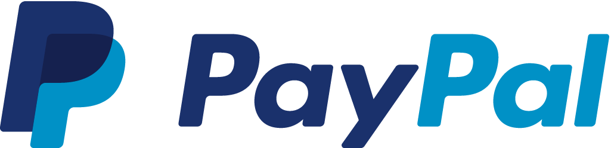

# Skiwu Downloader

Una aplicación gratuita para gestionar y organizar descargas de archivos de audio de manera eficiente.

## ⚠️ Aviso Importante

**Esta aplicación es INDEPENDIENTE y NO tiene ninguna relación con Qobuz.**

### 📋 Condiciones de Uso
- ✅ **Requiere cuenta personal válida en Qobuz**
- ✅ **No almacenamos ni gestionamos tus credenciales**
- ✅ **Eres responsable del uso de tus cuentas**
- ✅ **Debes cumplir con los Términos de Servicio de Qobuz**

## 📦 Instalación

### Descarga Directa
- Descargue la última versión del instalador desde nuestras [releases](https://simplan2.github.io/skiwu-updates/releases).

### Requisitos del Sistema
- **Sistema Operativo**: Windows 10/11 (64-bit)
- **.NET Framework**: .NET 8.0 Runtime
- **Espacio en disco**: 100 MB mínimo
- **Memoria RAM**: 4 GB recomendados
- **Conexión Internet**: Para descargas y gestión de cuentas

## 📄 Licencia y Términos

### Propiedad Intelectual
- El código fuente es propiedad de Juan Esteban V.
- **LICENSE.md** - Derechos del desarrollador

### Términos de Uso  
- **EULA.md** - Acuerdo de usuario final
- Uso gratuito para usuarios legítimos

[Ver LICENSE completo](LICENSE.md) | [Ver EULA completo](EULA.md)

## ⚠️ DESCARGO DE RESPONSABILIDAD

### RELACIÓN CON QOBUZ
Skiwu Downloader es una aplicación **INDEPENDIENTE** y **NO TIENE**:
- Ninguna afiliación, asociación o partnership con Qobuz
- Ningún acuerdo, endorsamiento o reconocimiento oficial
- Acceso especial o privilegiado a los servicios de Qobuz

El nombre "Qobuz" es una marca registrada de sus respectivos propietarios.

### FUNCIONALIDAD DEL SOFTWARE
Esta aplicación es un **GESTOR DE DESCARGAS** que:
- Facilita la gestión de descargas de audio personal
- Requiere que tengas tu propia cuenta válida en Qobuz
- NO almacena, registra ni gestiona credenciales de usuarios
- NO crea cuentas ni gestiona suscripciones de Qobuz

### RESPONSABILIDAD DEL USUARIO
Reconoces y aceptas que:
- Eres responsable de cumplir con los Términos de Servicio de Qobuz
- Debes poseer una cuenta legal y válida en Qobuz
- Eres responsable del uso que realices de tus credenciales
- Debes respetar los derechos de autor y leyes de propiedad intelectual

### ADVERTENCIAS LEGALES
- El mal uso puede violar los Términos de Servicio de Qobuz
- Eres responsable de verificar la legalidad de tus acciones
- El autor no fomenta ni aprueba la violación de derechos de autor
- El Software está diseñado para gestión personal de contenido legal

##
Esta aplicación es **completamente gratuita**. 
Tu apoyo ayuda a mantenerla activa.

### 🌟 Opciones de Apoyo:

| Plataforma | Enlace | Badge |
|------------|--------|-------|
| **PayPal** | [paypal.me/JEstban](https://paypal.me/JEstban) |  |